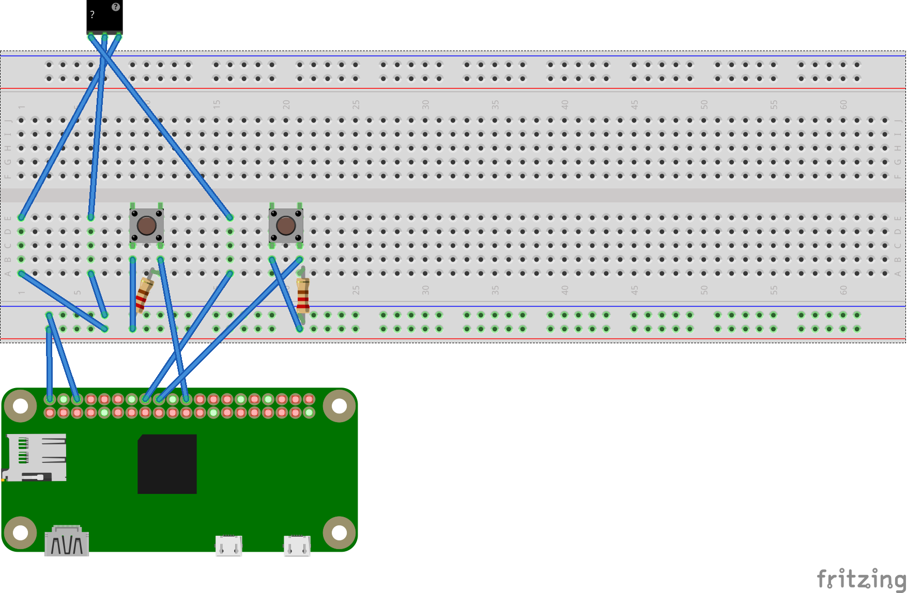
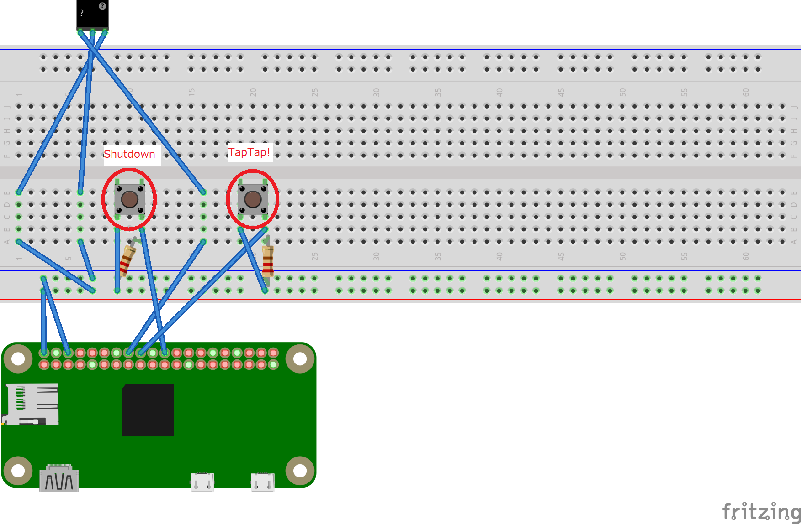

# TapTap

Raspberry pi Zero WHを利用し、タクトスイッチを押下することでリレータッチボードのOn/Offをループする「自動スマホタップ装置」を作成する。
また、シャットダウンするスイッチも用意する。

## Dependency

### Component dependency

- [Raspberry Pi Zero WH](https://www.switch-science.com/catalog/3646/) リンクはスイッチサイエンス社の販売ページ。
- [リレータッチボード（ドライバ有り）](https://www.switch-science.com/catalog/2455/) スイッチサイエンス社で販売されている、スマホ画面をタッチすることのできるボード。コード番号はSSCI-024556。
- [初心者向けの学習キット ラズベリー・パイ３/２model B](https://www.amazon.co.jp/gp/product/B075167Y4D/) 商品の説明欄にチュートリアルのリンクが記載されており、そこから各パーツの説明書をまとめたものをダウンロードできる。利用するパーツは以下の通り。
  - ブレッドボード x1
  - ジャンパーワイヤー（オス-オス）x9
  - ジャンパーワイヤー（オス-メス）x5
  - タクトスイッチ x2
  - 任意の抵抗 x2

### Application dependency

- [Node.js](https://nodejs.org/en/) 任意のバージョン
- [n](https://www.npmjs.com/package/n) 任意のバージョン
- [rpi-gpio](https://www.npmjs.com/package/rpi-gpio) v2.1.7 以上（このリポジトリのnode_module配下に配置済み）

## Setup

### Setup component

まず、以下のように結線する（配線が重なり合わないように接続先を入れ替えてもかまわない。）

パーツ「？」はスイッチサイエンス社の「リレータッチボード（ドライバ有り）」で、EN端子はPin16 = GPIO23を接続する。ある程度リレータッチボードから離れた場所へ自由に動かせる余裕が欲しいので、ジャンパーワイヤー（オス-オス）と（オス-メス）を接続し、コードの長さを延長すると良い。

タクトスイッチはPin18 = GPIO24、Pin22=GPIO25の2か所に接続し、GNDとは抵抗で接続する。抵抗の大きさは何でもよい（GNDが何ともつながっていないと動作が不安定になるそうなので、抵抗とGNDを接続する。）



### Setup application

#### Install Node.js

以下のようにコマンドを入力し、node.jsをインストールする。apt-getでインストールできるNode.jsは若干古いので、apt-getした後にNode.jsのバージョン管理ツール「n」を利用してNode.jsをバージョンアップする。

```shell
# apt-getでnode.jsをインストールする（同時にnpmもインストールしてくれる。）
user1@pi0:~ $ sudo apt-get update
user1@pi0:~ $ sudo apt-get install node.js

# Node.jsのバージョン管理ツール「n」をインストールする。
user1@pi0:~ $ sudo npm install n -g

# Node.jsの安定版、LTS版のバージョンを確認する。
user1@pi0:~ $ sudo n --stable
user1@pi0:~ $ sudo n --lts

# Node.jsの安定版、LTS版のどちらか一方をインストールする。好きな方をインストールすればよい。
user1@pi0:~ $ sudo n lts

# apt-getでインストールした古いNode.jsを削除する。
user1@pi0:~ $ sudo apt-get purge node.js

# いったんログアウトするか、exec $SHELL -lを実行し、そのあとにNode.jsのバージョンを確認して完了。
user1@pi0:~ $ node -v
```

なお、Raspberry pi ZeroはCPUのアーキテクチャがARMv6のため、すでにNode.jsの最新版はサポート対象外となっている（参考：<https://qiita.com/Xperd/items/018df0bac4c1674b71ed>。）

#### Run "TapTap"

Node.jsをインストールした後に、本リポジトリのファイルを任意の場所に配置する（例：/home/user01/TapTapに配置。）

そして、起動時にスクリプトを実行させるため、/etc/rc.localを編集する。

```shell
sudo vi /etc/rc.local
```

/etc/rc.localを変更していない場合、以下のように記述されている。

```shell
# Print the IP address
_IP=$(hostname -I) || true
if [ "$_IP" ]; then
  printf "My IP address is %s\n" "$_IP"
fi

exit 0
```

/etc/rc.localへ以下のように追記する。

```shell
# Print the IP address
_IP=$(hostname -I) || true
if [ "$_IP" ]; then
  printf "My IP address is %s\n" "$_IP"
fi

cd /home/user01/TapTap
nohup node taptap.js &

exit 0
```

修正後、以下のコマンドでrc.localのエラーをチェックする。エラーが発生しなければ完了。

```shell
sudo /etc/rc.local
```

## Usage

セットアップが完了すると、Raspberry pi Zero WHを起動することでスクリプトが起動し、タクトスイッチが有効になる。

下図の通り、左側のタクトスイッチはシャットダウンボタンとなる。5秒以上ボタンを押し続けるとシャットダウンを実行する。

右側のタクトスイッチは自動タップを行うボタンとなり、押下する度に自動タップの有効/無効をトグルする。



## License

- [TapTap](https://github.com/DNV825/TapTap), [WTFPL-2.0](http://www.wtfpl.net/)

```text
        DO WHAT THE FUCK YOU WANT TO PUBLIC LICENSE 
                    Version 2, December 2004 

 Copyright (C) 2004 Sam Hocevar <sam@hocevar.net> 

 Everyone is permitted to copy and distribute verbatim or modified 
 copies of this license document, and changing it is allowed as long 
 as the name is changed. 

            DO WHAT THE FUCK YOU WANT TO PUBLIC LICENSE 
   TERMS AND CONDITIONS FOR COPYING, DISTRIBUTION AND MODIFICATION 

  0. You just DO WHAT THE FUCK YOU WANT TO.
```

- [n](https://www.npmjs.com/package/n), [MIT Lisence](https://github.com/tj/n/blob/master/LICENSE)
- [rpi-gpio](https://www.npmjs.com/package/rpi-gpio), [MIT Lisence](https://github.com/JamesBarwell/rpi-gpio.js/blob/master/MIT-LICENSE.txt)

## Authors

- [TapTap](https://github.com/DNV825/TapTap), DNV825
- [n](https://www.npmjs.com/package/n), tj / shadowspawn / ... [and many contributers](https://github.com/tj/n/graphs/contributors)
- [rpi-gpio](https://www.npmjs.com/package/rpi-gpio),JamesBarwell / julienvincent / thecodershome / aslafy-z / pimterry / aztecrex / aleksipirttimaa / dawn-minion / andrewdotn / robertkowalski

## References

ハード

1. @Gadgetoid, Raspberry Pi Pinout, Pinout.xyz, -, <https://pinout.xyz/>
1. 福田 和宏, 特集1 モーターから小型画面まで電子パーツ450種最新ガイド, ラズパイマガジン 2021年春号/日経BP, 2021/02/27発行, ISBN 978-4-296-10855-8 <https://www.nikkeibp.co.jp/atclpubmkt/book/21/281660/>
1. ちりつも, 【費用1793円】スマホ自動タップ装置の作り方, ちりつもぶろぐ, 2020/10/01, <https://chiritsumo-blog.com/auto-tap-machine/>
1. shuichi, ラズパイ：タクトスイッチでPythonプログラムを動作させる, 人生は読めないブログ, 2020/08/16, <https://torisky.com/%E3%83%A9%E3%82%BA%E3%83%91%E3%82%A4%EF%BC%9A%E3%82%BF%E3%82%AF%E3%83%88%E3%82%B9%E3%82%A4%E3%83%83%E3%83%81%E3%81%A7python%E3%83%97%E3%83%AD%E3%82%B0%E3%83%A9%E3%83%A0%E3%82%92%E5%8B%95%E4%BD%9C/>
1. @K-Ponta, Raspberry Pi 3 B+に シャットダウンスイッチを付ける, Qiita, 2019/04/14, <https://qiita.com/K-Ponta/items/12127d7077d69a82693c>
1. 文系の伊藤さん, タクトスイッチは向きに注意, 文系の伊藤さんと電気の話, 2017/03/25, <https://ameblo.jp/bun-ito/entry-12259611903.html>
1. サンダー, ブレッドボードの使い方【ブレッドボードでLEDを光らせてみよう】, THUNDER BLOG, 2020/05/28, <https://thunderblog.org/2019/03/bread_board.html>
1. しなぷす, 【初心者向け】ブレッドボードとタクトスイッチで論理回路を作る(5), 京都しなぷすのハード制作日誌, 2020/05/14, <https://synapse.kyoto/hard/switch-logic/page005.html>

JavaScript/Node.js

1. Naotsugu, Node のバージョン管理ツール n の使い方, A Memorandum, 2019/11/26, <https://blog1.mammb.com/entry/2019/11/26/090000>
1. furoblog, 【JavaScript】日付処理で意識するべきこと, furoblog’s blog, 2019/04/25, <https://furoblog.hatenablog.com/entry/js-datediff>
1. Carlos Delgado, How to shutdown and reboot Linux with Node.js, OUR CODE WORLD, 2017/03/14, <https://ourcodeworld.com/articles/read/411/how-to-shutdown-and-reboot-linux-with-node-js>

Readme

1. からあげ (id:karaage) , READMEの良さそうな書き方・テンプレート【GitHub/Bitbucket】, からあげ, 2018/01/19, <https://karaage.hatenadiary.jp/entry/2018/01/19/073000>
1. matiassingers, Awesome README, github.com, 2020/02/28, <https://github.com/matiassingers/awesome-readme>
